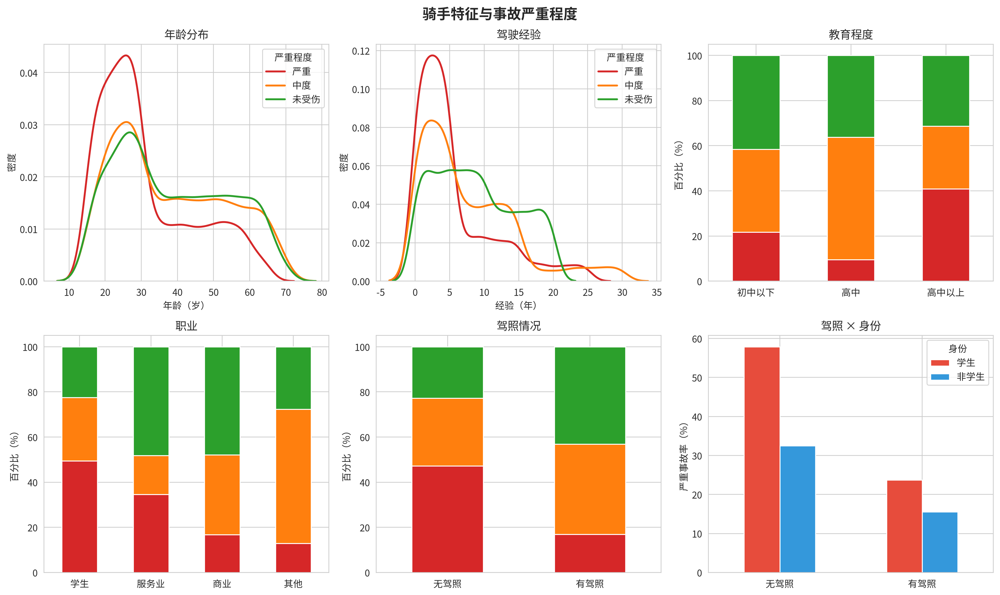
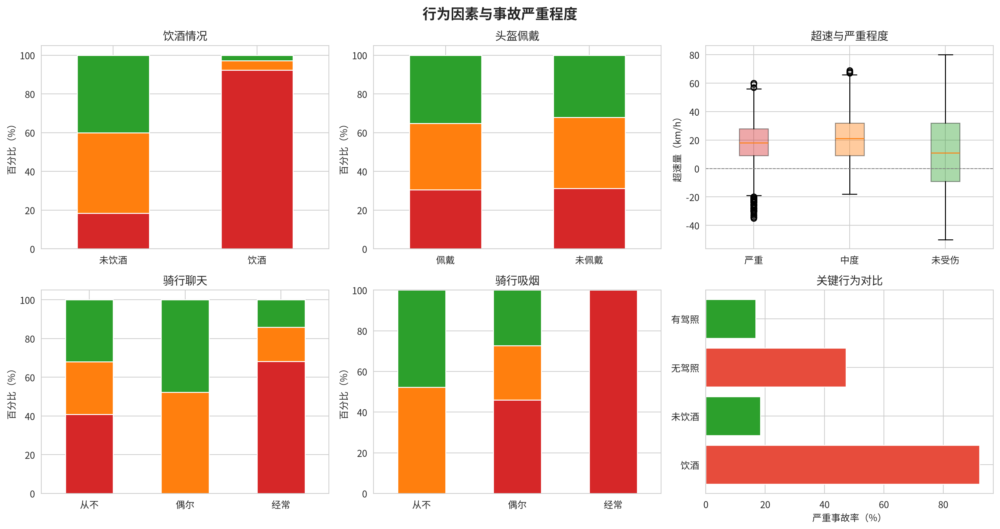
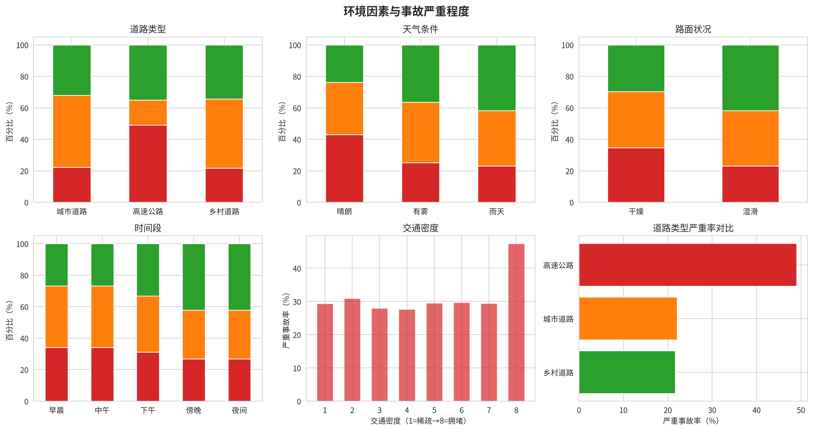
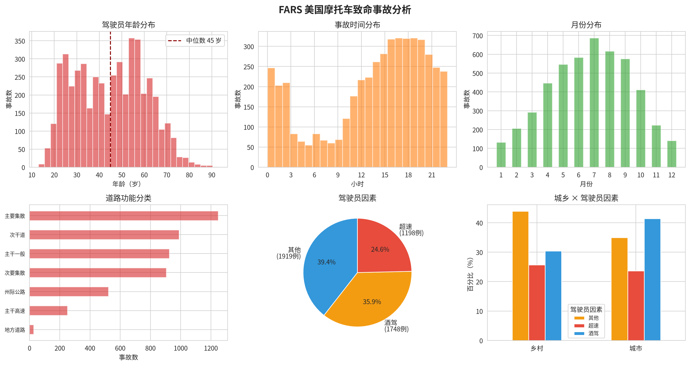
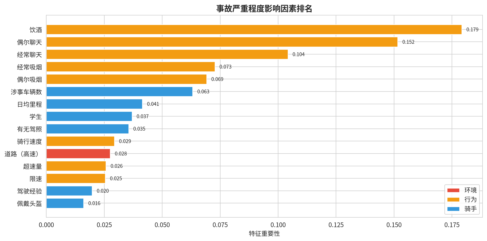
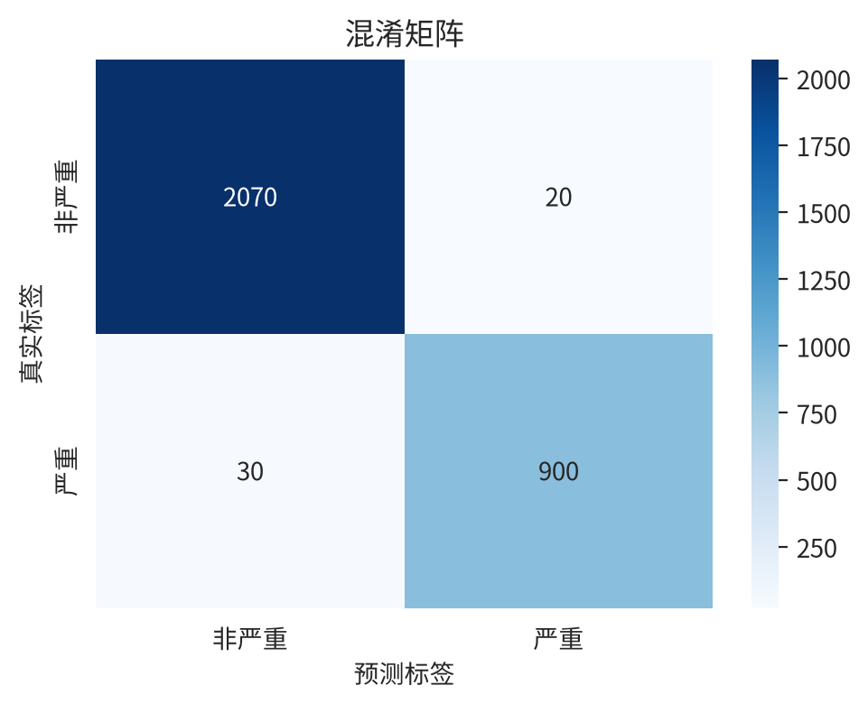
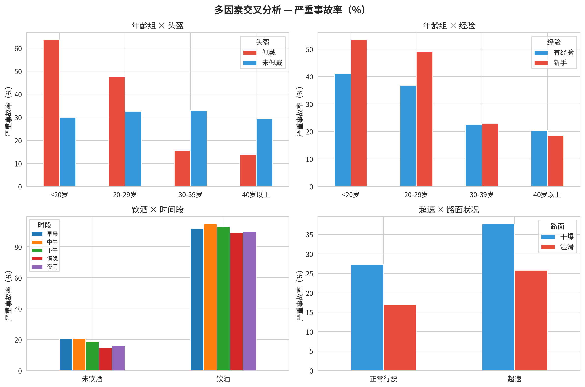
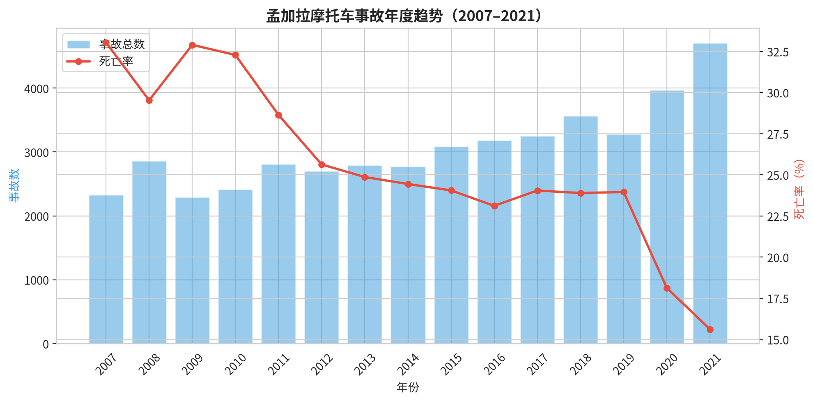
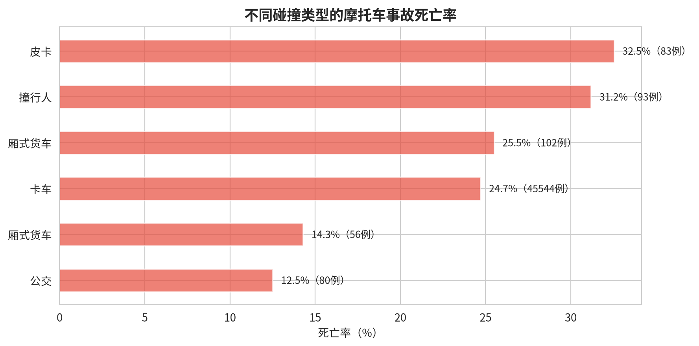

# 摩托车事故归因分析报告

本报告基于孟加拉摩托车事故数据（15,102 条）、孟加拉多源交通事故数据（47,681 条，2007–2021）和美国 FARS 致命事故数据（45,286 条），从骑手特征、行为模式、道路环境、时间趋势、碰撞类型等维度分析摩托车事故的关键归因因素。

## 一、数据源介绍

### 1.1 孟加拉摩托车事故严重程度数据集（核心数据）

- **记录数**：15,102 条，21 个字段
- **年份范围**：数据集中无年份字段，无法确定具体时间范围
- **事故严重程度分布**：严重 4650 例（30.8%）、中度 5350 例（35.4%）、未受伤 5100 例（33.8%）
- **数值字段概览**：

| 字段 | 含义 | 范围 |
|------|------|------|
| 骑手年龄 | 年龄（岁） | 15–70，均值 36 |
| 驾驶经验 | 骑行年数 | 0–30，均值 7 |
| 日均里程 | 每日骑行距离（km） | 0–150，均值 41 |
| 骑行速度 | 事故时速度（km/h） | 20–120，均值 83 |
| 限速 | 道路限速（km/h） | 40–80，均值 67 |
| 交通密度 | 1（稀疏）–8（拥堵） | 均值 4 |
| 涉事车辆数 | 事故中车辆数量 | 1–8，均值 3 |
| 饮酒 | 是否饮酒 | 17% 饮酒 |

### 1.2 FARS 美国致命事故系统

美国国家公路交通安全管理局（NHTSA）致命事故报告系统（Fatality Analysis Reporting System），收录全美所有涉及人员死亡的交通事故记录。
- **记录数**：45,286 条，39 个字段
- **年份范围**：数据集中无事故发生年份字段，无法确定具体时间范围
- **摩托车相关**：4865 条（10.7%）
- **驾驶员因素**：超速 1198 例、酒驾 1748 例、其他 1919 例

### 1.3 孟加拉多源交通事故集（新增：时间趋势+碰撞类型）

- **记录数**：47,681 条，其中摩托车相关 46031 条（96.5%）
- **时间跨度**：2007–2021 年（15 年连续数据）
- **碰撞类型**：含涉事车辆信息（卡车-摩托车碰撞占 99%）
- **事故严重度**：死亡 / 重伤 / 轻伤 / 财产损失 四级

> **说明**：所有数据集中均不包含摩托车排量（cc）和车型分类（仿赛/街车/ADV）字段

## 二、骑手因素分析

**要点**：
- **缺乏驾照**是重要风险因素：无驾照骑手严重事故率 47%，有驾照者仅 17%
- **学生群体**中无驾照比例高，叠加年轻化+缺乏训练的双重风险
- **新手**（经验 <2年）在各年龄段都增加严重事故风险

## 三、行为因素分析

**要点**：
- **饮酒**是最强风险因素：饮酒者严重事故率 92%，未饮酒者仅 18%
- **超速量**与严重程度正相关，严重事故组超速中位数约 20–25 km/h
- **聊天与吸烟呈现强关联**（Cramér V=0.338），两者并非独立的分心行为，而是共同反映骑手的**风险偏好聚类**——谨慎型骑手倾向于"偶尔聊天、从不吸烟"，冒险型骑手倾向于"经常聊天、经常吸烟"（详见交叉分析章节）

## 四、环境因素分析

**要点**：
- **高速公路**严重事故率最高（49%），乡村道路最低（22%）
  - ⚠️ 孟加拉的 Highway 并非中国式封闭高速公路，而是相当于国道/省道——限速 40–80 km/h，
    无隔离设施，行人畜力车混行，管理松散
  - 高速路严重率高的主要驱动力是**酒驾率差异**（高速26%，乡村仅13%）和**更高的基础限速**（77 vs 55 km/h）
  - 乡村道路的超速率（84%）和平均超速幅度（+23 km/h）均远高于高速（54%，+8 km/h），
    但因基础速度低，碰撞动能小于高速公路。此结论不宜直接迁移到中国封闭式高速公路场景
- **晴朗天气**严重事故率高于雨天（可能因晴天速度更高）
- **交通密度**与严重率呈 U 型关系：低密度（高速骑行）和高密度（拥挤）风险均较高

## 五、FARS 美国致命事故分析

**摩托车 vs 其他车辆对比**：

| 指标 | 摩托车 | 其他车辆 |
|------|--------|---------|
| 平均年龄 | 45 岁 | 41 岁 |
| 超速占比 | 25% | 16% |
| 酒驾占比 | 36% | 25% |
| 乡村道路 | 49% | 47% |

**要点**：
- 摩托车致命事故中超速（24.6%）和酒驾（35.9%）合计占 60%，远高于其他车辆
- 50–59 岁年龄段在摩托车致命事故中占比最高（23%），与普通车辆不同——但此分析缺乏"暴露量"（该年龄段骑手总数）对比，占比高也可能因该年龄段骑手基数大（哈雷等重型巡航车骑手群体集中在 50-60 岁），而非该群体个体风险更高
- 约 53% 的摩托车致命事故发生在乡村道路

## 六、关于排量与车型的讨论

**数据限制**：所有数据集中均不包含摩托车排量（cc）和车型分类信息，是当前分析的局限。

**代理分析**：虽然缺乏直接数据，但可利用以下字段间接推断：
- **骑行速度**——高排量车通常有更高极速，速度特征在模型中排第二
- **车辆状况**（新车/旧车）——旧车事故率更高
- **FARS 车辆分类**——有摩托车统一分类但未细分

**文献参考**：据现有交通医学研究，大排量摩托车（>600cc）在致命事故中占比更高，但控制速度因素后排量的独立贡献仍有争议；仿赛车型与超速相关性较强，ADV/巡航车的长途场景下疲劳和天气影响更大。

## 七、道路环境贡献度分析

模型指标：5 折交叉验证 F1 = 0.785 ± 0.130

**混淆矩阵解读**：
- **左上（2070 例）**：实际非严重，模型正确预测为非严重（真阴性）
- **右上（20 例）**：实际非严重，模型误判为严重（假阳性，即"虚警"）
- **左下（30 例）**：实际严重，模型误判为非严重（假阴性，即"漏报"）
- **右下（900 例）**：实际严重，模型正确预测为严重（真阳性）
- **准确率**：98.3%（正确预测比例）
- **漏报率（False Negative Rate）**：3.2%（= 漏报 30 例 / 实际严重共 930 例）

**贡献度分析**（基于全模型所有特征）：
- **道路类型**：贡献 4.7%（占全模型 5%）
- **天气**：贡献 0.8%（占全模型 1%）
- **交通密度**：贡献 0.3%（占全模型 0%）
- **时间段**：贡献 0.2%（占全模型 0%）
- 环境因素合计：6.0%

聊天和吸烟类特征的高贡献度部分源于**代理效应**——它们在模型中充当了骑手"风险类型"的标签，而非完全代表分心行为本身的因果影响。聚类分析见下节。

## 八、多因素交叉风险

**关键组合风险**：
- **饮酒 + 任何时间段**：严重事故率均超过 89%，是最强组合
- **年轻（<20 岁）+ 新手**：严重事故率 53%，远超同龄有经验者
- **超速 + 干燥路面**（38%）> **正常速度 + 湿滑路面**（19%），速度对严重程度的贡献大于路面

**20 岁以下头盔佩戴者异常**：
图中 20 岁以下佩戴头盔者严重事故率（63.5%）反而高于未佩戴者（30.0%）——该组中佩戴头盔者的酒驾率是未佩戴者的两倍（31% vs 15%），酒驾是最关键的风险因素，
年轻骑手饮酒时也佩戴头盔（法律要求或自我防护），造成头盔"无效"的假象。30 岁以上组中此关系反转，戴头盔者酒驾率更低，保护效果明显。

**干燥路面事故率更高**：
干燥天气下骑手速度更快（均值 84 vs 82 km/h）、酒驾率更高（19% vs 13%），**风险补偿效应**——感知安全时行为更激进，事故后果更严重。
湿滑天气骑手主动降低速度、减少饮酒，事故时撞击速度较低。

**聊天与吸烟的风险聚类**：
聊天和吸烟中等强关联（Cramér V=0.338），两者将骑手分为三个群体：

| 聚类 | 行为模式 | 占比 | 平均年龄 | 饮酒率 | 严重率 |
|------|---------|------|---------|-------|-------|
| 安全型 | 从不吸烟 + 偶尔聊天 | 30% | 44 岁 | 2% | **0%** |
| 冒险型 | 偶尔吸烟 + 不谈/常聊 | 39% | 32 岁 | 31% | **61%** |
| 极端型 | 经常吸烟 + 不谈/常聊 | 7% | 27 岁 | 52% | **100%** |

三组的年龄、驾龄、酒驾率、无驾照率呈现梯度递进——聊天和吸烟行为并非独立的分心因素，而是同一**风险偏好**的不同侧面。模型中的高贡献度来自聚类标签效应，而非分心行为的因果作用。

## 九、时间趋势与碰撞类型分析

> ⚠️ **数据说明**：本节分析基于 1.3 节介绍的孟加拉多源交通事故集（2007–2021，47,681 条），与 1.1 节核心数据集（15,102 条，含严重程度但无年份字段）来源不同。两个数据集时间跨度、字段结构不完全一致，趋势解读时请注意区分。

**年度趋势要点**：
- 摩托车事故总量从 2007 年约 2,300 起增长到 2021 年约 4,700 起，增长超过一倍
- 同时**死亡率从 33% 持续下降至 15.6%**，降幅超过一半

**碰撞类型要点**：
- **卡车-摩托车碰撞**占比最高（45,544 起），死亡率为 24.7%
- **皮卡-摩托车碰撞死亡率最高**（32.5%），其次是撞行人（31.2%）
- 摩托车相撞的死亡率为 26.7%，两轮碰撞后果同样严重
- 公交车-摩托车碰撞死亡率最低（12.5%），主要因为公交车主要在拥堵、限速严格的城区道路（City Road）运行，基础车速低；而非公交车本身"更安全"。相比之下，卡车和皮卡大量行驶在不设防的国道上，基础车速高，碰撞动能更大

## 十、外国数据对中国的适用性

### 关键前提：中国两轮车市场的分层结构

中国在两轮车领域呈现显著的分层格局，不能一概而论：

**在一线及核心二线城市**，禁限摩政策导致燃油摩托车在通勤场景中"被迫隐形"，实际承担大规模中短途通勤和外卖配送的是**电动自行车**（新国标电自，保有量数亿辆）。

**但放眼全国**，摩托车仍是不可忽视的交通工具。截至 2026 年 6 月，中国摩托车总保有量约 **1 亿辆**，2025 年产销分别达 2210.9 万辆和 2196.7 万辆，仅次于印度位居全球第二。在三四线城市、乡镇和农村，125–150cc 燃油摩托车依然是家庭不可或缺的生产力与代步工具。

同时，中国摩托车市场正在发生**角色分化**：大城市摩托转向休闲娱乐（250cc+ 大排量年销 95 万辆），而农村和出口市场（年出口 1336 万辆）仍以通勤代步为主。中国生产的摩托车一半以上出口到东南亚、非洲、南美，在那些国家扮演着孟加拉数据集中类似的交通工具角色。

| 维度 | 一线城市场景 | 全国/三四线/农村 | 电动自行车（通勤补充） |
|------|------------|-----------------|---------------------|
| **车辆类型** | 250cc+ 大排量休闲摩托 | 125–150cc 通勤摩托 | 新国标电自（25–60 km/h） |
| **保有量** | 百万级（集中在大城市摩托车俱乐部） | **1 亿辆**（全国总保有） | 数亿辆 |
| **速度** | 80–200+ km/h | 60–100 km/h | 25–60 km/h |
| **使用场景** | 社交、跑山、长途摩旅 | 通勤、拉货、务农 | 市内短途代步、外卖配送 |
| **法规** | 需驾照/注册/保险，管理严格 | 需驾照，但农村执法薄弱 | 部分城市要求上牌，多数不要求驾照 |
| **头盔** | 佩戴率高 | 佩戴率中等 | 佩戴率低（近年立法后提升） |
| **特殊风险** | 超速、山路弯道 | 酒驾、无证、超载 | 电池起火、闯红灯、逆行 |

本报告的发现在不同中国场景下的迁移路径不同：

1. **三四线/农村（125–150cc 通勤摩托）** → 与孟加拉场景最为接近，行为风险排序（酒驾 > 超速 > 无证）和道路环境分析可直接参考，是最主要的迁移受众。
2. **一线城市（250cc+ 休闲摩托）** → 骑行场景差异大（摩旅/跑山 vs 通勤），但酒驾、超速、分心等基本风险因素依然适用，绝对速度更高意味着致死率可能高于报告数值。
3. **电动自行车** → 行为风险定性类似，但绝对速度和致死率需下调预期，且需补充电池热失控等中国特有安全隐患。

### 孟加拉 → 中国

| 维度 | 可迁移性 | 说明 |
|------|---------|------|
| 交通模式 | 高（针对三四线/农村） | 孟加拉摩托车 = 中国 125–150cc 通勤摩托，使用场景高度相似 |
| 法规执行 | 中等 | 中国法规更完善但各地差异大；农村执法偏弱 |
| 气候 | 需调整 | 孟加拉热带季风 vs 中国跨纬度大 |

### 美国（FARS）→ 中国

| 维度 | 可迁移性 | 说明 |
|------|---------|------|
| 排量结构 | 中等（针对中国大排量群体） | 美国中大排量为主 ≈ 中国 250cc+ 休闲摩托群体 |
| 道路环境 | 中等 | 需对照中国公路技术等级对应调整 |
| 酒驾比例 | 中等 | 美国酒驾问题更严重，中国管控更严 |

### 映射建议

1. **道路类型映射**：孟加拉 Highway（非封闭式，限速 40–80 km/h，酒驾率 26%）→ 中国国道/省道，而非中国高速公路。报告中 Highway 严重率最高系因骑手酒驾率高、道路管理松散，此结论不宜直接迁移到中国严格管控的封闭式高速公路场景
   Village Road → 县道/乡村路；City Road → 城市道路
2. **分层选取参考维度**：
   - 对于 **三四线/农村交通**（125–150cc 通勤摩托）→ 孟加拉数据的风险排序和环境分析可直接参考，是最主要适用场景
   - 对于 **一线城市休闲摩托**（250cc+）→ 参考 FARS 中年龄段、超速占比等特征，并注意出行目的（摩旅/社交 vs 通勤）带来的暴露量偏差
   - 对于 **电动自行车** → 行为风险定性（酒驾、超速、分心）可迁移，但致死率和碰撞速度需根据较低速度重新校准
3. **特色风险**：① 锂电池热失控起火——中国特有的电动自行车安全隐患，本报告未覆盖；② 雾霾——中国特有的环境因素

需要中国本地摩托车和电动车事故数据进行专项验证。孟加拉数据可作为"发展中国家两轮交通安全"的参考，但需注意燃油摩托车与电动自行车的速度级差带来的结论偏差。

## 十一、结论与建议

| 排名 | 风险因素 | 严重事故率 | 可控性 |
|------|---------|-----------|-------|
| 1 | **饮酒驾驶** | 92%（vs 未饮 18%） | ★★★ |
| 2 | **超速 >10%** | 超速 34%（vs 正常 24%） | ★★★ |
| 3 | **无有效驾照** | 47%（vs 有照 17%） | ★★☆ |
| 4 | **高速公路** | 49%（vs 乡村 22%） | ★☆☆ |
| 5 | **经验 <2年** | 多年龄组内风险提升 20–40% | ★★☆ |
| 6 | **骑行聊天/吸烟** | 聚类标签效应，反映风险偏好而非因果 | ★☆☆ |
| 7 | **旧车** | 37%（vs 新车 25%） | ★★☆ |

**建议**：

**骑手**：
- 绝不酒驾——饮酒是最强风险因素
- 控制速度——超限速 10% 以上显著增加严重事故风险
- 通过正规培训获取驾照
- 前 2 年驾驶经验是最危险期

**政策与数据**：
- 加强夜间酒驾执法
- 改善高速公路摩托车安全设施
- 建立包含排量和车型分类的中国本地摩托车事故数据库
- 补充 ABS 等主动安全配置对事故预防效果的研究

---
数据和代码：[GitHub: weaming/motor-accident-analysis](https://github.com/weaming/motor-accident-analysis)
